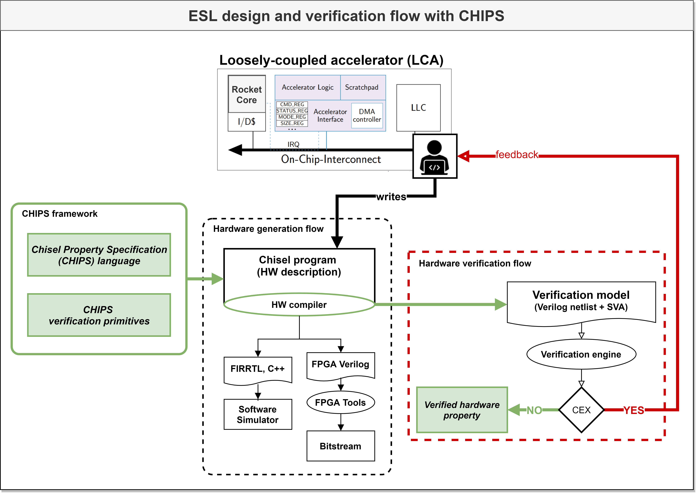

# CHIPS: Chisel Hardware Property Specification Language

A major impediment to agile Electronic System-Level (ESL) design is the fact that novel ecosystems for hardware IP
generation and SoC integration often rely on arduous verification methodologies unsuited for agile system design teams.

## Framework

The foundation of the CHIPS framework is a domain specific language (DSL) embedded in
[Scala](https://www.scala-lang.org/) that allows specification of lightweight verification properties on different
levels of abstraction using the assertion-based verification paradigm. This repository contains the CHIPS core language.

## ESL flow with CHIPS

The hardware developer starts with an implementation of a parameterized hardware
generator ([Chisel](https://www.chisel-lang.org/) program) for a loosely-coupled accelerator. The use of our CHIPS DSL
enables him to specify verification properties as assertions and assumptions by adding them directly to the Chisel
program. In addition, predefined verification primitives from the CHIPS library can be used to simplify property
specification.

## License

[Apache License 2.0](./LICENSE)

## Acknowledgment

This research is partially funded by the German Federal Ministry of Education and Research (BMBF) within the project Scale4Edge (grant number 16ME0126).
